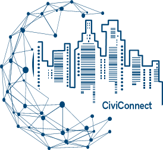

<p align="center">
  
</p>

<p align="center">
  📱 Mobile App for urban issue reporting and management. 📱  
  <br>
  A project for  
  <br>
  Software Engineering and Software Project Management  
  <br>
  courses of Computer Science at University of Salerno.
</p>

---

# Project Description and Introduction

CiviConnect is a mobile application designed to facilitate communication between citizens and local administrations. The app enables users to report and manage urban issues efficiently and transparently.

## Introduction

📱 🎓 Mobile App for urban issue management. Developed for the **Software Engineering** and **Software Project Management** courses at the University of Salerno.

## Authors

* **Luigi Bacco**         - *Project Manager*   - [GitHub Profile](https://github.com/Luigi11162)
* **Benedetto Scala**     - *Project Manager*   - [GitHub Profile](https://github.com/benedettoscala)
* **Generoso Sorridi**    - *Developer*         - [GitHub Profile](https://github.com/DarkSassio)
* **Marco Brescia**       - *Developer*         - [GitHub Profile](https://github.com/Marco-Brescia)
* **Francesco Faiella**   - *Developer*         - [GitHub Profile](https://github.com/FaiellaFrancesco)
* **Gianluigi Citro**     - *Developer*         - [GitHub Profile](https://github.com/Borax-Gargamella)
* **Giuseppe Speranza**   - *Developer*         - [GitHub Profile](https://github.com/Peppe289)
* **Manuel Cieri**        - *Developer*         - [GitHub Profile](https://github.com/Type-Here)
* **Domenico Auriemma**   - *Developer*         - [GitHub Profile](https://github.com/domyz21)
* **Giuseppe Gambardella** - *Developer*        - [GitHub Profile](https://github.com/GiuseppeGambardella)

---

# Technical Information

## Built With

* [Flutter](https://flutter.dev/) - Framework for cross-platform mobile development.
* [Firebase](https://firebase.google.com/) - Backend-as-a-Service for database, authentication, and cloud services.
* [Firestore](https://firebase.google.com/products/firestore) - NoSQL database for data persistence.
* [Dart](https://dart.dev/) - Programming language used with Flutter.
* [OpenStreetMap](https://www.openstreetmap.org/) - Open source geographic mapping services.

## Clone and run the project locally

### Prerequisites

1. Install [Flutter](https://flutter.dev/docs/get-started/install) and Dart SDK.
2. Install Android Studio or another code editor compatible with Flutter.
3. Configure an Android emulator or connect a physical device for testing.

### Steps

1. Clone the repository:
   ```bash
   git clone https://github.com/benedettoscala/CiviConnect.git
   ```
2. Navigate to the project directory:
   ```bash
   cd CiviConnect
   ```
3. Install dependencies:
   ```bash
   flutter pub get
   ```
4. Run the project:
   ```bash
   flutter run
   ```
5. View the application on the emulator or connected device.

---

# Documentation

* The process documentation is available in the `docs` directory.
* Details about requirements and design can be found in the project's **RAD** and **SDD**.

---

# Contributors

<a href="https://github.com/benedettoscala/CiviConnect/graphs/contributors">
  
</a>
